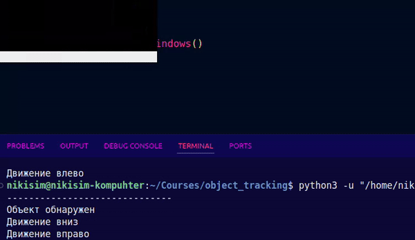

# Object tracking task

## Simple OpenCV tracking

Для простого трекинга объектов использовалась библиотека OpenCV с выделением фона и последущим применением морфологической операции открытия (дилатация + эрозия), чтобы убрать "маленькие белые точки" из маски. После этого, нахождение контуров и отрисовка bounding box. В консоль выводится информация о направлении движении обнаруженного объекта.


Результаты:




## Yolo object tracking

Для усложенения была примененена нейросеть YOLO. Использование YOLO в данной задаче является излишним, тем не менее, данная нейросеть справляется с обнаружением и трекингом объектов.

Результаты применения YOLO:


## How to download YOLOv3

```bash
# Download YOLOv3 weights
wget https://pjreddie.com/media/files/yolov3.weights

# Download YOLOv3 config file
wget https://raw.githubusercontent.com/pjreddie/darknet/master/cfg/yolov3.cfg

# Download coco.names file (list of class labels)
wget https://raw.githubusercontent.com/pjreddie/darknet/master/data/coco.names
```